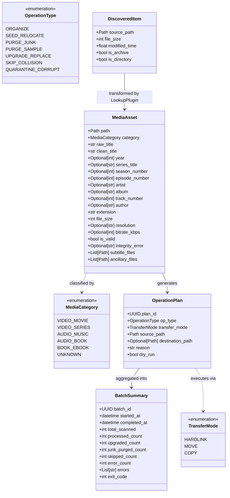
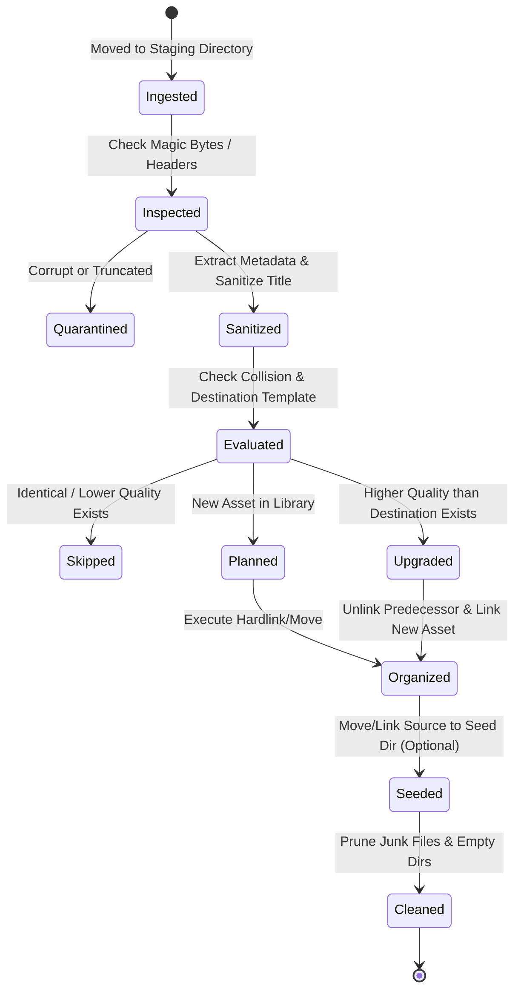

# Data Model: Pluggable Media Cleaner and Organizer

This document defines the domain entities, relationships, validation constraints, and lifecycle states for Media-Cron.

---

## Entity Diagram

---

## Entity Definitions

### 1. `DiscoveredItem`
Raw item found during ingestion before metadata parsing.

| Field | Type | Required | Description |
|---|---|---|---|
| `source_path` | `pathlib.Path` | Yes | Absolute path to the discovered file or folder |
| `file_size` | `int` | Yes | Size in bytes |
| `modified_time` | `float` | Yes | POSIX timestamp of last modification |
| `is_archive` | `bool` | Yes | Flag indicating if file is compressed (`.zip`, `.rar`) |
| `is_directory` | `bool` | Yes | Flag indicating if item is a directory |

---

### 2. `MediaAsset`
Enriched entity containing normalized metadata, classification, and associated assets.

| Field | Type | Required | Description |
|---|---|---|---|
| `path` | `pathlib.Path` | Yes | Current staging path of the asset |
| `category` | `MediaCategory` | Yes | Classification (Movie, TV Series, Music, Audiobook, E-book) |
| `raw_title` | `str` | Yes | Original unparsed filename or title |
| `clean_title` | `str` | Yes | Sanitized title with junk/scene tokens stripped |
| `year` | `Optional[int]` | No | 4-digit release year (1900–2100) |
| `series_title` | `Optional[str]` | No | Show name for episodic content |
| `season_number` | `Optional[int]` | No | 1-indexed season number |
| `episode_number` | `Optional[int]` | No | 1-indexed episode number |
| `artist` | `Optional[str]` | No | Music artist or band |
| `album` | `Optional[str]` | No | Album or release title |
| `track_number` | `Optional[int]` | No | Track sequence number |
| `author` | `Optional[str]` | No | Book/audiobook author |
| `extension` | `str` | Yes | Normalized lowercase file extension (e.g., `.mkv`, `.mp3`) |
| `file_size` | `int` | Yes | Size in bytes |
| `resolution` | `Optional[str]` | No | Video resolution tag (`2160p`, `1080p`, `720p`, `480p`) |
| `bitrate_kbps` | `Optional[int]` | No | Detected audio/video bitrate in kbps |
| `is_valid` | `bool` | Yes | Integrity verification status |
| `integrity_error`| `Optional[str]` | No | Reason if container/stream integrity failed |
| `subtitle_files` | `List[pathlib.Path]` | Yes | Associated subtitle files (`.srt`, `.ass`, etc.) |
| `ancillary_files`| `List[pathlib.Path]` | Yes | Associated artwork or chapter files |

---

### 3. `OperationPlan`
Actionable unit of work specifying exact source, destination, and execution mode.

| Field | Type | Required | Description |
|---|---|---|---|
| `plan_id` | `uuid.UUID` | Yes | Unique identifier for operation |
| `op_type` | `OperationType` | Yes | Specific operation category |
| `transfer_mode` | `TransferMode` | Yes | Transfer strategy (`HARDLINK`, `MOVE`, `COPY`) |
| `source_path` | `pathlib.Path` | Yes | Source file path to act upon |
| `destination_path` | `Optional[pathlib.Path]` | No | Destination path (null for deletions) |
| `reason` | `str` | Yes | Human-readable explanation of why action is planned |
| `dry_run` | `bool` | Yes | If true, operation must not mutate filesystem |

---

### 4. `BatchSummary`
Top-level execution report produced at pipeline completion.

| Field | Type | Required | Description |
|---|---|---|---|
| `batch_id` | `uuid.UUID` | Yes | Unique identifier for batch execution |
| `started_at` | `datetime.datetime` | Yes | UTC timestamp when processing started |
| `completed_at` | `datetime.datetime` | Yes | UTC timestamp when processing completed |
| `total_scanned` | `int` | Yes | Count of items scanned in staging/source |
| `processed_count` | `int` | Yes | Successfully organized media items |
| `upgraded_count` | `int` | Yes | Existing items replaced due to higher quality |
| `junk_purged_count` | `int` | Yes | Clutter files deleted |
| `skipped_count` | `int` | Yes | Items skipped (e.g. existing same quality, locked) |
| `error_count` | `int` | Yes | Count of failed operations or corrupted assets |
| `errors` | `List[str]` | Yes | Descriptive list of error strings |
| `exit_code` | `int` | Yes | Deterministic process exit code (0, 1, 2, 3) |

---

## Lifecycle State Transitions

