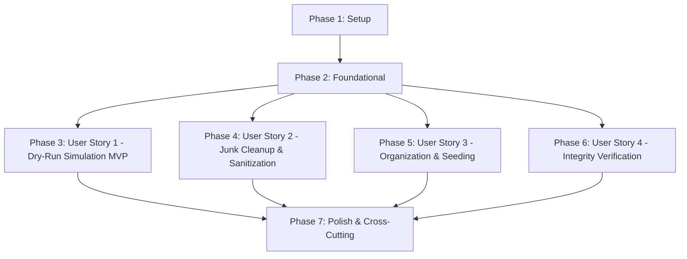

# Tasks: Standalone Media File Organizer and Cleaner CLI

**Branch**: `001-media-cleaner-organizer` | **Spec**: [spec.md](spec.md) | **Plan**: [plan.md](plan.md)

---

## Phase 1: Setup (Shared Infrastructure)

**Purpose**: Project initialization, directory structure, packaging, and linting configuration

- [X] T001 Create project directory structure (`media_cron/`, `media_cron/plugins/`, `media_cron/integrity/`, `tests/unit/`, `tests/contract/`, `tests/integration/`) per plan.md
- [X] T002 Initialize Python project packaging configuration with dependencies (`typer`, `pyyaml`, `tinytag`, `pytest`, `pytest-mock`) in pyproject.toml
- [X] T003 [P] Configure code formatting, linting, and type-checking rules in ruff.toml

---

## Phase 2: Foundational (Blocking Prerequisites)

**Purpose**: Core data models, plugin protocols, registry, configuration, and lock management that MUST be complete before ANY user story can be implemented

**⚠️ CRITICAL**: No user story work can begin until this phase is complete

- [X] T004 [P] Implement core domain models (`MediaCategory`, `TransferMode`, `OperationType`, `DiscoveredItem`, `MediaAsset`, `OperationPlan`, `BatchSummary`) in media_cron/models.py
- [X] T005 [P] Implement abstract plugin protocols (`InputPlugin`, `LookupPlugin`, `OutputPlugin`) in media_cron/plugins/base.py
- [X] T006 [P] Implement plugin discovery and registration manager (`PluginRegistry`) in media_cron/plugins/registry.py
- [X] T007 [P] Implement configuration loader with YAML schema parsing and `MEDIA_CRON_*` environment variable overrides in media_cron/config.py
- [X] T008 [P] Implement non-blocking staging directory lockfile manager (`fcntl.flock`) and safe exit handlers in media_cron/lock.py
- [X] T009 Setup test configuration, temporary filesystem factories, and mock asset fixtures in tests/conftest.py
- [X] T010 [P] Implement unit tests for configuration loader and environment overrides in tests/unit/test_config.py
- [X] T011 [P] Implement unit tests for lockfile acquisition and concurrency contention in tests/unit/test_lock.py

**Checkpoint**: Foundation ready — user story implementation can now begin in parallel or sequentially

---

## Phase 3: User Story 1 - Safe Inspection and Dry-Run Simulation (Priority: P1) 🎯 MVP

**Goal**: Provide non-destructive simulation scanning that previews all renames, purges, and moves without modifying any files on disk, outputting human or JSON reports with deterministic exit codes.

**Independent Test**: Execute `media-cron organize --source <dir> --staging <staging> --destination <dest> --dry-run --format json`; verify that the complete planned operation list is emitted, exit code is 0, and all files on disk remain completely unmodified.

### Tests for User Story 1 ⚠️

> **NOTE: Write these tests FIRST, ensure they FAIL before implementation**

- [X] T012 [P] [US1] Write contract test for input plugin discovery protocol in tests/contract/test_input_contract.py
- [X] T013 [P] [US1] Write integration test for CLI dry-run simulation mode and JSON response schema in tests/integration/test_dry_run_simulation.py

### Implementation for User Story 1

- [X] T014 [P] [US1] Implement `DirectoryScannerInput` with non-destructive discovery and staging moves in media_cron/plugins/input/directory.py
- [X] T015 [US1] Implement core pipeline engine (`Pipeline.plan()`) for dry-run simulation in media_cron/pipeline.py
- [X] T016 [US1] Implement CLI `organize` command with `--dry-run`, `--format text|json`, and deterministic exit codes in media_cron/cli.py

**Checkpoint**: At this point, User Story 1 is fully functional as a safe, standalone inspection and dry-run CLI (MVP complete).

---

## Phase 4: User Story 2 - Junk File Purging and Filename Sanitization (Priority: P2)

**Goal**: Purge non-media clutter (`.nfo`, `.txt`, `.url`, sub-50MB samples) while sanitizing filenames for video, audio, and e-books, and preserving associated subtitle files (`.srt`, `.ass`, `.sub`).

**Independent Test**: Run cleanup and sanitization on an isolated folder containing sample files, junk files, and messy filenames; verify junk and samples are deleted, empty parent directories are pruned, and media and subtitle files are cleanly renamed.

### Tests for User Story 2 ⚠️

- [X] T017 [P] [US2] Write unit tests for filename sanitization heuristics across video, audio, and e-books in tests/unit/test_naming.py
- [X] T018 [P] [US2] Write unit tests for junk file detection and sample clip threshold pruning in tests/unit/test_cleaner.py
- [X] T019 [P] [US2] Write contract test for lookup plugin protocol in tests/contract/test_lookup_contract.py
- [X] T020 [P] [US2] Write integration test for junk purging, subtitle pairing, and empty directory removal in tests/integration/test_cleanup_sanitization.py

### Implementation for User Story 2

- [X] T021 [P] [US2] Implement `SceneVideoLookup` for scene tag parsing, resolution extraction, and title sanitization in media_cron/plugins/lookup/video.py
- [X] T022 [P] [US2] Implement `AudioTagLookup` for extracting artist, album, track, and bitrate using `tinytag` in media_cron/plugins/lookup/audio.py
- [X] T023 [P] [US2] Implement `BookMetaLookup` for inspecting EPUB and PDF title/author metadata in media_cron/plugins/lookup/book.py
- [X] T024 [P] [US2] Implement `JunkCleanerOutput` for purging clutter, sub-50MB samples, and pruning empty directories in media_cron/plugins/output/cleaner.py
- [X] T025 [US2] Integrate lookup plugins and junk cleaner into pipeline execution in media_cron/pipeline.py

**Checkpoint**: User Stories 1 AND 2 work together independently. Files are discovered, cleaned of clutter, and sanitized.

---

## Phase 5: User Story 3 - Atomic Library Organization via Moves or Hardlinks (Priority: P3)

**Goal**: Transfer verified media into custom path templates via atomic hardlink, move, or copy; support quality-based collision upgrades; and support user-configurable seed directory relocation.

**Independent Test**: Run `media-cron organize` with `--destination`, `--mode hardlink`, and `--seed-dir`; verify files appear at templated destination paths, inodes match source for continued seeding, and collision upgrades replace lower-quality files.

### Tests for User Story 3 ⚠️

- [X] T026 [P] [US3] Write unit tests for customizable path template resolution (movies, series, music, books) in tests/unit/test_path_templates.py
- [X] T027 [P] [US3] Write contract test for output plugin protocol in tests/contract/test_output_contract.py
- [X] T028 [P] [US3] Write integration test for staging move, seeding relocation, and library hardlinking in tests/integration/test_staging_seeding.py
- [X] T029 [P] [US3] Write integration test for quality-based collision upgrades (bitrate/resolution) in tests/integration/test_collision_upgrade.py

### Implementation for User Story 3

- [X] T030 [P] [US3] Implement `LibraryOrganizerOutput` with atomic hardlink/move/copy and quality upgrade evaluation in media_cron/plugins/output/organizer.py
- [X] T031 [P] [US3] Implement `SeedRelocatorOutput` for relocating source material to configured seed directory in media_cron/plugins/output/seed.py
- [X] T032 [US3] Integrate staging ingestion, destination organization, and seed relocation into pipeline execution in media_cron/pipeline.py

**Checkpoint**: User Stories 1, 2, and 3 work together. Files are staged, sanitized, cleaned, organized into library templates, and relocated to seed directories.

---

## Phase 6: User Story 4 - Media Integrity Verification Prior to Relocation (Priority: P4)

**Goal**: Inspect media container headers (Matroska EBML, MP4 atoms, audio magic bytes, e-book archives) and halt truncated or corrupted files from entering libraries.

**Independent Test**: Process an intentionally truncated or corrupted media container; verify the file is flagged as invalid, excluded from destination libraries, and recorded in batch errors with exit code 1.

### Tests for User Story 4 ⚠️

- [X] T033 [P] [US4] Write unit tests for container header and magic byte validation in tests/unit/test_integrity.py
- [X] T034 [P] [US4] Write integration test for corrupted container quarantine and error reporting in tests/integration/test_integrity_pipeline.py

### Implementation for User Story 4

- [X] T035 [US4] Implement container integrity validator (EBML/MKV header, MP4 `ftyp`/`moov`, audio headers, ZIP/EPUB) in media_cron/integrity/validator.py
- [X] T036 [US4] Integrate integrity verification gate into pipeline before destination file operations in media_cron/pipeline.py

**Checkpoint**: All 4 user stories are fully implemented and verified.

---

## Phase 7: Polish & Cross-Cutting Concerns

**Purpose**: End-to-end integration validation, documentation, linting, and final verification

- [X] T037 [P] Write end-to-end CLI integration test executing all scenarios from quickstart.md in tests/integration/test_cli_e2e.py
- [X] T038 [P] Document installation, CLI commands, configuration options, and cron/container examples in README.md
- [X] T039 Run ruff lint and type checks across all modules in media_cron/ and tests/
- [X] T040 Run complete pytest test suite and verify 100% pass rate and exit code determinism across tests/

---

## Dependencies & Execution Order

### Phase Dependencies

- **Setup (Phase 1)**: No dependencies — can start immediately.
- **Foundational (Phase 2)**: Depends on Setup completion — **BLOCKS all user stories**.
- **User Story 1 (Phase 3)**: MVP baseline. Can start immediately once Foundational is complete.
- **User Story 2 (Phase 4)**: Can proceed in parallel with US1 once Foundational is complete.
- **User Story 3 (Phase 5)**: Can proceed in parallel once Foundational is complete; integrates with US1/US2.
- **User Story 4 (Phase 6)**: Can proceed in parallel once Foundational is complete; guards US3 operations.
- **Polish (Phase 7)**: Depends on all user stories completing.

### Within Each User Story

- Test tasks must be written first and asserted to fail prior to implementation.
- Models and protocols precede plugin implementations.
- Plugin implementations precede pipeline orchestration integration.
- Story must be verified independently before declaring complete.

---

## Parallel Opportunities

- **Phase 1**: `T003` can run in parallel with `T002`.
- **Phase 2**: `T004`, `T005`, `T006`, `T007`, `T008`, `T010`, `T011` can all be implemented in parallel across independent files.
- **User Story 1**: `T012`, `T013`, `T014` can run in parallel.
- **User Story 2**: `T017`, `T018`, `T019`, `T020`, `T021`, `T022`, `T023`, `T024` can run in parallel across separate plugin and test files.
- **User Story 3**: `T026`, `T027`, `T028`, `T029`, `T030`, `T031` can run in parallel across separate files.
- **User Story 4**: `T033`, `T034` can run in parallel.
- **Polish**: `T037`, `T038` can run in parallel.

---

## Implementation Strategy

### MVP First (User Story 1 Only)

1. Complete **Phase 1: Setup** (`T001`–`T003`).
2. Complete **Phase 2: Foundational** (`T004`–`T011`) — creates shared models, lockfile manager, and config loader.
3. Complete **Phase 3: User Story 1** (`T012`–`T016`) — delivers the working `--dry-run` inspection CLI.
4. **VALIDATE**: Run `tests/integration/test_dry_run_simulation.py` to confirm MVP delivers immediate, safe utility.

### Incremental Delivery

1. **Increment 1 (MVP)**: Setup + Foundational + Story 1 (`media-cron organize --dry-run`).
2. **Increment 2**: Add Story 2 → Automated clutter purging and title sanitization (`JunkCleanerOutput`, `SceneVideoLookup`, `AudioTagLookup`, `BookMetaLookup`).
3. **Increment 3**: Add Story 3 → Atomic organization into custom path templates, quality collision upgrade, and seed directory relocation (`LibraryOrganizerOutput`, `SeedRelocatorOutput`).
4. **Increment 4**: Add Story 4 → Container integrity checks before relocation.
5. **Increment 5**: Polish → Full quickstart validation, README documentation, and final linting.
