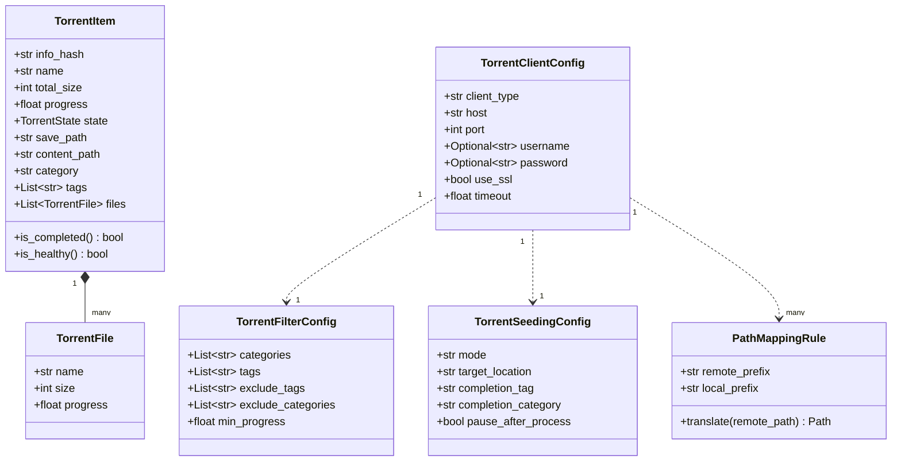
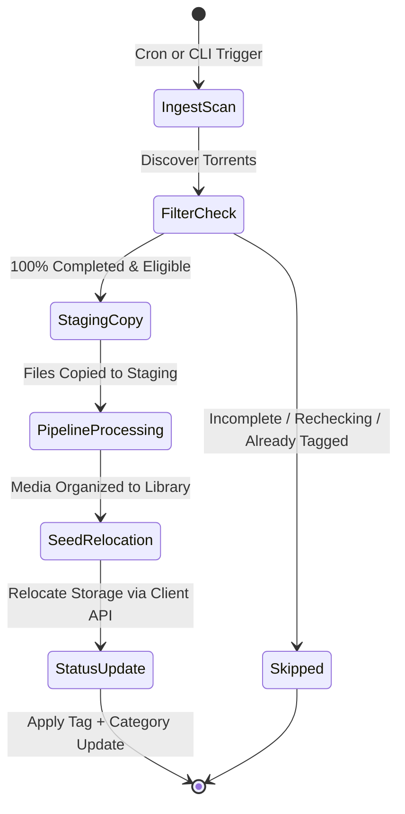

# Data Model: Torrent Client Integration

**Branch**: `002-torrent-client-integration` | **Date**: 2026-09-07 | **Spec**: [spec.md](spec.md)

## Entity Relationship Overview

---

## Entities & Schemas

### 1. `TorrentState` (Enum)
Represents the operational state of a torrent inside the client.

- `DOWNLOADING`: Active downloading in progress.
- `SEEDING`: 100% complete and actively uploading.
- `COMPLETED`: 100% complete and finished downloading.
- `PAUSED`: Torrent execution paused by user or policy.
- `CHECKING`: Hash check in progress.
- `ERROR`: Client encountered an I/O, network, or data error.
- `UNKNOWN`: Unrecognized client state.

---

### 2. `TorrentFile` (Dataclass)
Represents an individual file entry contained within a torrent payload.

| Field | Type | Description |
|---|---|---|
| `name` | `str` | Relative path of the file inside the torrent payload |
| `size` | `int` | Size of the file in bytes |
| `progress` | `float` | File completion percentage (0.0 to 1.0) |

---

### 3. `TorrentItem` (Dataclass)
Represents a torrent managed by an external client.

| Field | Type | Description |
|---|---|---|
| `info_hash` | `str` | Hexadecimal info-hash uniquely identifying the torrent |
| `name` | `str` | Display name / top-level directory name of the release |
| `total_size` | `int` | Total payload size in bytes |
| `progress` | `float` | Completion ratio (1.0 = 100% completed) |
| `state` | `TorrentState` | Current operational state |
| `save_path` | `str` | Remote save directory reported by the client |
| `content_path` | `str` | Absolute path to the content root reported by the client |
| `category` | `str` | Category assigned in the client (e.g. `radarr`, `movies`) |
| `tags` | `list[str]` | List of tags applied to the torrent in the client |
| `files` | `list[TorrentFile]` | Individual files contained in the torrent payload |

**Validation Rules**:
- `is_completed()`: Returns `True` if `progress >= 1.0` and `state` is either `SEEDING`, `COMPLETED`, or `PAUSED`.
- `is_healthy()`: Returns `True` if `state` is not `ERROR` and not `CHECKING`.

---

### 4. `PathMappingRule` (Dataclass)
Defines path translation between remote client filesystems and local mounts.

| Field | Type | Description |
|---|---|---|
| `remote_prefix` | `str` | Path prefix as reported by the torrent client |
| `local_prefix` | `str` | Local filesystem path prefix accessible to media-cron |

**Method: `translate(remote_path: str) -> Path`**:
- Checks if `remote_path` starts with `remote_prefix`.
- If matching, strips `remote_prefix` and prepends `local_prefix`, returning a resolved POSIX `Path`.
- If no match, returns `Path(remote_path)`.

---

### 5. `TorrentClientConfig` (Dataclass)
Defines external torrent client connection parameters.

| Field | Type | Default | Description |
|---|---|---|---|
| `client_type` | `str` | `"qbittorrent"` | Provider identifier (`qbittorrent`, `transmission`, `deluge`) |
| `host` | `str` | `"localhost"` | Hostname or IP address of the client Web/RPC API |
| `port` | `int` | `8080` | Web API port number |
| `username` | `str \| None` | `None` | Optional username for authentication |
| `password` | `str \| None` | `None` | Optional password for authentication (masked in logs) |
| `use_ssl` | `bool` | `False` | Whether to connect via HTTPS |
| `timeout` | `float` | `10.0` | Socket timeout in seconds |
| `path_mappings` | `list[PathMappingRule]` | `[]` | Path prefix mapping rules |

---

### 6. `TorrentFilterConfig` (Dataclass)
Defines which torrents qualify for automated ingestion.

| Field | Type | Default | Description |
|---|---|---|---|
| `categories` | `list[str]` | `[]` | Allowed categories (empty means all categories allowed) |
| `tags` | `list[str]` | `[]` | Required tags (empty means any tag allowed) |
| `exclude_tags` | `list[str]` | `["media-cron-processed"]` | Excluded tags (skips already processed torrents) |
| `exclude_categories` | `list[str]` | `["media-cron-done"]` | Excluded categories (skips processed categories) |
| `min_progress` | `float` | `1.0` | Minimum progress threshold (1.0 = 100% complete) |

---

### 7. `TorrentSeedingConfig` (Dataclass)
Governs seeding behavior post-organization.

| Field | Type | Default | Description |
|---|---|---|---|
| `mode` | `str` | `"client_relocate"` | Seeding mode: `client_relocate`, `direct_filesystem`, `none` |
| `target_location` | `str` | `"seed_dir"` | Relocation target: `seed_dir` or `destination_dir` |
| `completion_tag` | `str` | `"media-cron-processed"` | Tag applied upon successful pipeline completion |
| `completion_category`| `str` | `"media-cron-done"` | Category assigned upon successful pipeline completion |
| `pause_after_process`| `bool` | `False` | Whether to pause the torrent after processing |

---

## State Transition Lifecycle

