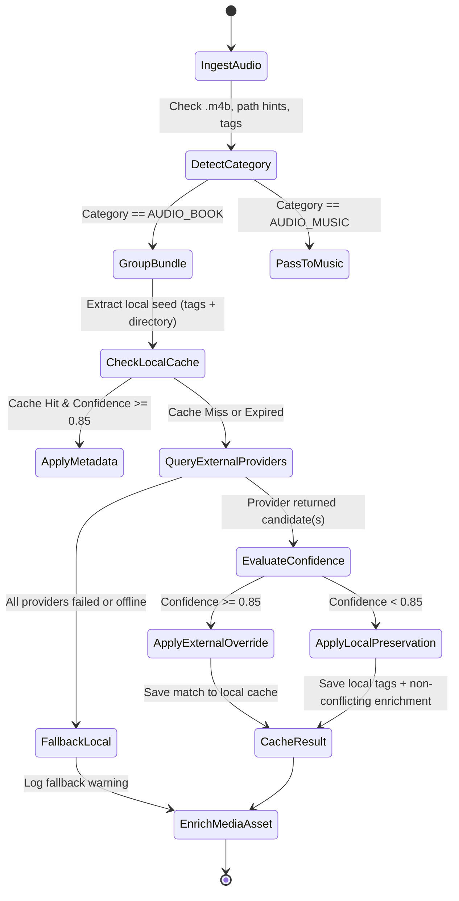

# Data Model: Audiobook Identification and Author Disambiguation

**Branch**: `003-audiobook-identification` | **Date**: 2026-09-08 | **Spec**: [spec.md](spec.md)

## 1. Domain Entities & Schemas

### 1.1 `MetadataMatch`
Represents an external or local metadata candidate retrieved during identification.

| Field | Type | Description |
|---|---|---|
| `title` | `str` | Canonical title of the book work |
| `author` | `str` | Primary author or creator name |
| `year` | `int | None` | Original publication or release year |
| `narrator` | `str | None` | Narrator or voice performer (if available) |
| `series` | `str | None` | Series or book universe name |
| `volume` | `str | None` | Volume, book number, or position in series |
| `work_id` | `str | None` | External catalog identifier (e.g. OpenLibrary work ID, ASIN) |
| `provider` | `str` | Source provider (`"openlibrary"`, `"audnexus"`, `"local_tag"`, `"filename"`) |
| `confidence` | `float` | Calculated match confidence score $[0.0, 1.0]$ |
| `raw_response` | `dict[str, Any]` | Raw payload from provider (for debugging and telemetry) |

### 1.2 `AudiobookBundle`
Represents a group of audio files forming a single audiobook work (single file or multi-file chapter set).

| Field | Type | Description |
|---|---|---|
| `root_path` | `Path` | Root directory containing the audiobook or path to single audio file |
| `is_multi_file` | `bool` | `True` if bundle consists of multiple audio tracks, `False` for single `.m4b`/`.mp3` |
| `files` | `list[Path]` | Ordered list of constituent audio file paths |
| `seed_title` | `str` | Candidate title extracted from embedded tags or parent folder name |
| `seed_author` | `str | None` | Candidate author extracted from embedded tags or parent folder name |
| `matched_metadata` | `MetadataMatch | None` | Resolved canonical metadata after local and external evaluation |
| `total_size_bytes` | `int` | Cumulative byte size of all tracks in the bundle |

### 1.3 `ExternalProviderConfig`
Configuration model for an external book metadata service.

| Field | Type | Default | Description |
|---|---|---|---|
| `provider_name` | `str` | (Required) | Identifier (`"openlibrary"`, `"audnexus"`) |
| `enabled` | `bool` | `True` | Whether this provider participates in queries |
| `priority` | `int` | `10` | Evaluation priority (lower numbers queried first) |
| `base_url` | `str` | (Default per provider) | Base API endpoint URL |
| `api_key` | `str | None` | `None` | Optional API token/key for authenticated endpoints |
| `timeout_seconds` | `float` | `5.0` | HTTP request timeout in seconds |
| `rate_limit_delay` | `float` | `1.0` | Minimum delay between requests to this service |

### 1.4 `MetadataCacheEntry`
Persisted record stored in the local file cache.

| Field | Type | Description |
|---|---|---|
| `cache_key` | `str` | SHA-256 hash of `provider:normalized_title:normalized_author` |
| `provider` | `str` | Provider that supplied the result |
| `query_title` | `str` | Normalized title used in query |
| `query_author` | `str | None` | Normalized author used in query |
| `created_at` | `float` | Epoch timestamp of cache insertion |
| `ttl_seconds` | `int` | Expiration time-to-live in seconds (default `2592000` = 30 days) |
| `match` | `MetadataMatch | None` | Cached candidate match, or `None` for negative/not-found cache |

### 1.5 `AudiobookTelemetry`
Telemetry record appended to pipeline summary output.

| Field | Type | Description |
|---|---|---|
| `bundle_path` | `str` | File or directory path of the processed audiobook |
| `work_title` | `str` | Resolved canonical work title |
| `author` | `str` | Resolved canonical author name |
| `provider_source` | `str` | Source of identification (`"openlibrary"`, `"audnexus"`, `"local_tag"`, `"filename"`) |
| `confidence` | `float` | Overall confidence score $[0.0, 1.0]$ |
| `cached` | `bool` | `True` if result was served from local cache, `False` if live network call |
| `lookup_latency_ms` | `float` | Lookup latency in milliseconds |
| `narrator` | `str | None` | Identified narrator (if enriched) |
| `series` | `str | None` | Identified series title (if enriched) |

---

## 2. Confidence Evaluation & State Transitions

---

## 3. Validation Rules

1. **Category Guard (FR-013)**: Audio file is classified as `AUDIO_BOOK` if extension is `.m4b` OR parent path contains `"audiobook"`. For `.mp3`/`.m4a`, only treated as `AUDIO_BOOK` if directory hints exist or tag genre is `"audiobook"` / `"audio book"` / `"spoken word"`.
2. **Confidence Threshold Guard (FR-005)**: External match title and author ONLY replace existing local title/author if $\text{confidence} \ge 0.85$.
3. **Partial Enrichment Guard**: If $\text{confidence} \in [0.60, 0.85)$, local author and title are preserved, but missing secondary fields (narrator, series, year) from the external match are adopted.
4. **Offline Fallback Guard (FR-006, FR-007)**: When network errors, HTTP 429/5xx, or offline mode occurs, system falls back to embedded tags, then filename tokens, with $\text{confidence} = 0.50$ (filename) or $0.75$ (embedded tags).
