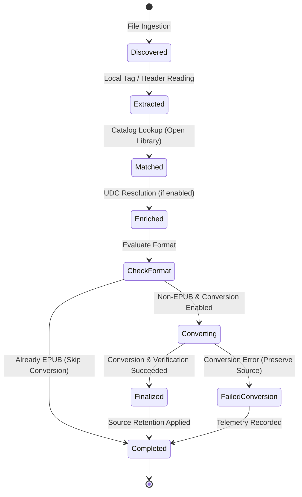
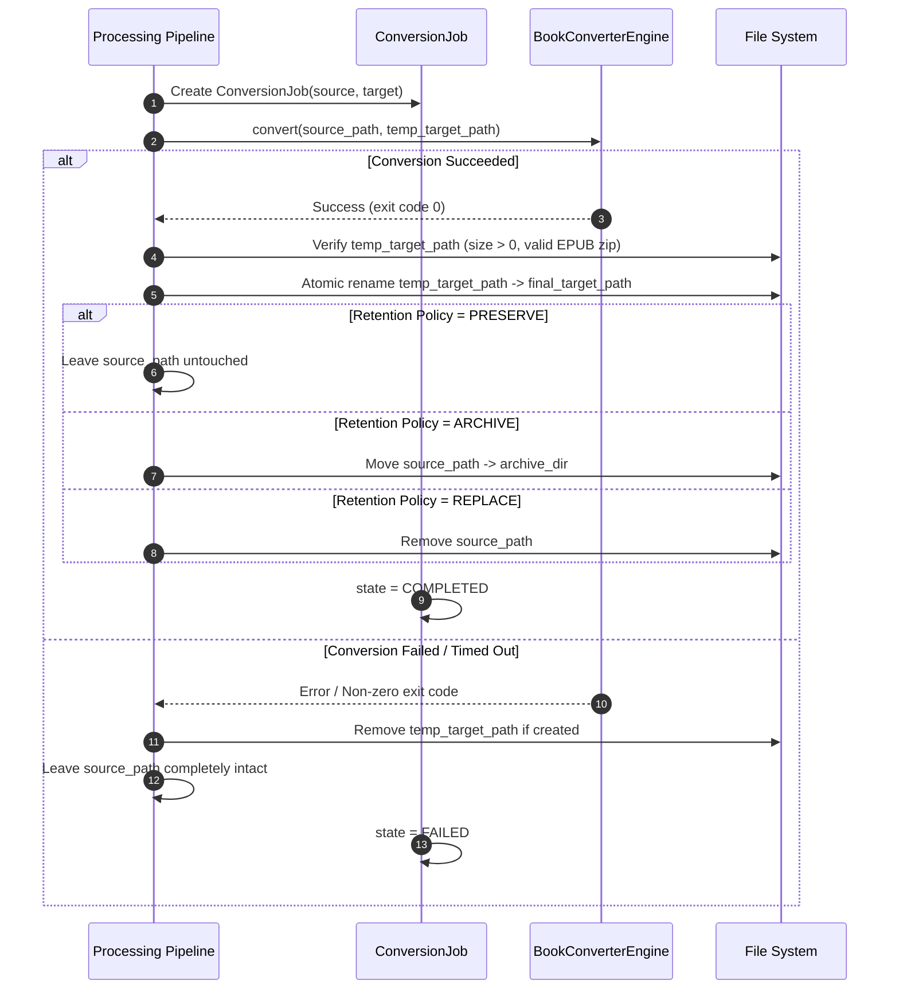

# Data Model: Book Identification, UDC Classification, and EPUB Conversion

**Feature**: Book Identification, UDC Classification, and EPUB Conversion  
**Branch**: `004-book-identification-conversion`  
**Date**: 2026-09-09  

## Overview

This document defines the core domain entities, data schemas, validation constraints, and lifecycle state transitions for processing digital books, looking up Universal Decimal Classification (UDC) codes, and managing format conversion to standard EPUB within `media_cron`.

---

## 1. Entities & Schemas

### 1.1 `BookFormat` (Enum)

Supported digital book formats:

| Format Code | File Extensions | Category | Extraction Engine | Converter Support |
|---|---|---|---|---|
| `EPUB` | `.epub` | Standard Container | Native ZIP / OPF XML | Target Standard (No conversion needed) |
| `MOBI` | `.mobi` | PalmDOC Binary | PDB / EXTH Header Parser | Calibre (`ebook-convert`) |
| `AZW` | `.azw`, `.azw3`, `.kf8` | Kindle Binary | PDB / EXTH Header Parser | Calibre (`ebook-convert`) |
| `PDF` | `.pdf` | Fixed / Document | Info Dict / XMP Stream | Calibre (`ebook-convert`) |
| `FB2` | `.fb2` | FictionBook XML | Native XML Parser | Calibre & Python Fallback |
| `CBZ` | `.cbz` | Comic Archive | ComicInfo.xml Parser | Metadata-only / Calibre |
| `TXT` | `.txt` | Plain Text | Filename heuristic + Text Read | Calibre & Python Fallback |
| `UNKNOWN` | Other | Unsupported | Filename heuristic | Skipped |

---

### 1.2 `BookMetadata`

Represents normalized metadata for a book (both extracted locally and resolved canonically from external catalogs):

```python
@dataclass
class BookMetadata:
    title: str
    author: str
    series_name: str | None = None
    volume_number: str | None = None
    publisher: str | None = None
    publication_year: int | None = None
    isbn: str | None = None
    asin: str | None = None
    language: str | None = "en"
    subjects: list[str] = field(default_factory=list)
    description: str | None = None
    udc_code: str | None = None
    extra: dict[str, Any] = field(default_factory=dict)
```

**Field Constraints & Validation Rules**:
- `title`: Non-empty string. Stripped of surrounding whitespace. If missing from local file, defaults to sanitized filename stem.
- `author`: Non-empty string. If missing, defaults to `"Unknown Author"` or candidate author from filename heuristic.
- `publication_year`: 4-digit integer between 1000 and 2100 if present.
- `isbn`: Normalized alphanumeric string stripped of hyphens and whitespace (valid ISBN-10 or ISBN-13 length).
- `subjects`: List of trimmed strings, deduplicated case-insensitively.

---

### 1.3 `UDCClassification`

Represents a Universal Decimal Classification entry assigned to a book:

```python
@dataclass
class UDCClassification:
    notation: str  # e.g., "82-311.9"
    description: str  # e.g., "Literature - Fiction - Science fiction"
    parent_notation: str | None = None  # e.g., "82-31"
    confidence: float = 1.0  # 1.0 for direct match, 0.7 for parent category
    source: str = "summary_table"  # "summary_table", "ddc_crosswalk", "catalog"
```

**Notation Schema**:
- Standard UDC hierarchical notation format (digits and auxiliary symbols like `-`, `.`, `(0...)`).
- Valid top-level classes: `0`, `1`, `2`, `3`, `5`, `6`, `7`, `8`, `9`.

---

### 1.4 `RetentionPolicy` (Enum)

Determines what happens to the original non-EPUB source file upon successful conversion:

| Policy | Value | Behavior | Failure Safety |
|---|---|---|---|
| `PRESERVE` | `"preserve"` | Keep original source file in place alongside generated EPUB (Default) | Source file never moved or deleted |
| `ARCHIVE` | `"archive"` | Move original file to designated archive directory after conversion succeeds | Moved only if target EPUB verified |
| `REPLACE` | `"replace"` | Delete original source file after conversion succeeds and target EPUB is verified | Deleted only if target EPUB verified |

---

### 1.5 `ConversionJob`

Represents an atomic conversion task transforming a source file into standard EPUB:

```python
@dataclass
class ConversionJob:
    job_id: str  # Unique UUID string
    source_path: Path
    source_format: BookFormat
    target_format: BookFormat = BookFormat.EPUB
    temp_target_path: Path  # Temporary file path during conversion
    final_target_path: Path  # Desired final .epub destination path
    retention_policy: RetentionPolicy = RetentionPolicy.PRESERVE
    archive_dir: Path | None = None
    state: ConversionState = ConversionState.PENDING
    engine_name: str = "calibre"  # "calibre" or "python_fallback"
    error_message: str | None = None
    duration_seconds: float = 0.0
    output_size_bytes: int = 0
```

---

### 1.6 `BookAsset`

Represents a complete digital book entity being processed through the pipeline:

```python
@dataclass
class BookAsset:
    path: Path
    format: BookFormat
    file_size_bytes: int
    local_metadata: BookMetadata
    canonical_metadata: BookMetadata
    udc_classification: UDCClassification | None = None
    confidence: float = 0.0
    match_source: str = "local_tag"  # "external_openlibrary", "local_tag", "filename"
    conversion_job: ConversionJob | None = None
    is_already_standard: bool = False  # True if already .epub
```

---

### 1.7 `BookMetadataCacheEntry`

Persistent disk cache schema for book catalog queries and UDC lookups:

```json
{
  "cache_key": "openlibrary:dune:frank herbert",
  "provider": "openlibrary",
  "query_title": "dune",
  "query_author": "frank herbert",
  "created_at": 1788931200.0,
  "ttl_seconds": 2592000,
  "metadata": {
    "title": "Dune",
    "author": "Frank Herbert",
    "publication_year": 1965,
    "isbn": "9780441172719",
    "subjects": ["Science Fiction", "Space Opera", "Desert Ecology"],
    "confidence": 0.95
  },
  "udc_classification": {
    "notation": "82-311.9",
    "description": "Literature - Fiction - Science fiction",
    "confidence": 1.0,
    "source": "summary_table"
  }
}
```

---

## 2. State Transitions

### 2.1 Book Asset Processing Lifecycle



### 2.2 Conversion Job Lifecycle & Failure Isolation


