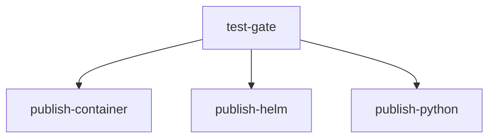

# Contract: GitHub Actions Workflows (CI/CD Pipeline)

**Feature Branch**: `008-precommit-cicd-publishing`
**Date**: 2026-09-13
**Spec**: [spec.md](../spec.md)

---

## 1. Scope & Location

- **CI Workflow**: `.github/workflows/ci.yml`
- **Release Workflow**: `.github/workflows/release.yml`

---

## 2. CI Workflow Contract (`ci.yml`)

### 2.1 Triggers
- `pull_request`: target `main`.
- `push`: target `main`.

### 2.2 Permissions
- `contents: read` (Strictly read-only least privilege).

### 2.3 Jobs

| Job ID | Runner | Matrix | Steps / Commands |
|---|---|---|---|
| `lint-and-test` | `ubuntu-latest` | `python-version: ["3.11", "3.12"]` | 1. Checkout code 2. Setup Python 3. Install dependencies (`pip install -e ".[dev]"`) 4. Run `ruff check .` 5. Run `ruff format --check .` 6. Run `pytest` |
| `container-validate` | `ubuntu-latest` | None | 1. Checkout code 2. Set up Docker Buildx 3. Build `Dockerfile` for `linux/amd64` (`--load` or no push) |
| `helm-validate` | `ubuntu-latest` | None | 1. Checkout code 2. Set up Helm 3. Run `helm lint charts/media-cron` 4. Run `helm template test charts/media-cron` |
| `package-validate` | `ubuntu-latest` | None | 1. Checkout code 2. Setup Python 3. Install `build`, `twine` 4. Run `python -m build` 5. Run `twine check --strict dist/*` |

---

## 3. Release Workflow Contract (`release.yml`)

### 3.1 Triggers
- `push`: `tags: ['v*.*.*']` (Semantic version tags).

### 3.2 Permissions
- `contents: write` (Required to attach `.whl` and `.tar.gz` to GitHub Releases).
- `packages: write` (Required to push container images and Helm charts to GHCR).

### 3.3 Job Dependency Graph

### 3.4 Job Specifications

#### Job 1: `test-gate`
- **Purpose**: Strict release gate ensuring release tag passes all automated tests before any artifact publishing.
- **Steps**: Setup Python, install dependencies, run `ruff check`, run `pytest`.

#### Job 2: `publish-container`
- **Needs**: `test-gate`
- **Steps**:
  1. Set up QEMU for ARM64 emulation (`docker/setup-qemu-action`).
  2. Set up Docker Buildx (`docker/setup-buildx-action`).
  3. Log in to GitHub Container Registry (`ghcr.io`) using `${{ secrets.GITHUB_TOKEN }}`.
  4. Generate OCI metadata and tags (`docker/metadata-action`):
     - `type=semver,pattern={{version}}`
     - `type=semver,pattern={{major}}.{{minor}}`
     - `type=semver,pattern={{major}}`
     - `type=raw,value=latest`
  5. Build and push multi-architecture image:
     - Platforms: `linux/amd64,linux/arm64`
     - Tags: generated metadata tags.

#### Job 3: `publish-helm`
- **Needs**: `test-gate`
- **Steps**:
  1. Set up Helm (`azure/setup-helm`).
  2. Extract tag version (strip leading `v`).
  3. Package Helm chart: `helm package charts/media-cron --version ${VERSION} --app-version ${VERSION} -d dist/charts`.
  4. Log in to GHCR registry: `echo "${{ secrets.GITHUB_TOKEN }}" | helm registry login ghcr.io -u ${{ github.actor }} --password-stdin`.
  5. Push OCI chart: `helm push dist/charts/media-cron-${VERSION}.tgz oci://ghcr.io/${{ github.repository_owner }}/charts`.

#### Job 4: `publish-python`
- **Needs**: `test-gate`
- **Steps**:
  1. Set up Python 3.11.
  2. Install `build` and `twine`.
  3. Build source distribution and binary wheel: `python -m build`.
  4. Validate archives: `twine check --strict dist/*`.
  5. Upload packages to GitHub Release using GitHub CLI (`gh release upload ${{ github.ref_name }} dist/*.tar.gz dist/*.whl`).
