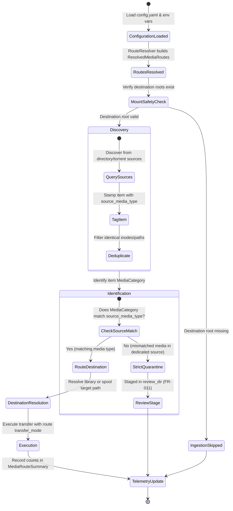

# Data Model: Per-Media-Type Source & Destination Routing

**Feature Branch**: `009-media-source-destination-routing`
**Date**: 2026-10-07
**Spec**: [spec.md](spec.md)

---

## 1. Domain Entities & Enums

### 1.1 Endpoint Types

```python
from enum import StrEnum


class SourceEndpointType(StrEnum):
    DIRECTORY = "directory"
    TORRENT = "torrent"


class DestinationEndpointType(StrEnum):
    LIBRARY = "library"
    SPOOL = "spool"
```

### 1.2 Media Classification Mapping

```python
class SupportedMediaType(StrEnum):
    MUSIC = "music"
    AUDIOBOOKS = "audiobooks"
    BOOKS = "books"
    MOVIES = "movies"
    TV = "tv"
```

Mapping from `SupportedMediaType` to domain `MediaCategory`:
- `SupportedMediaType.MUSIC` → `MediaCategory.AUDIO_MUSIC`
- `SupportedMediaType.AUDIOBOOKS` → `MediaCategory.AUDIO_BOOK`
- `SupportedMediaType.BOOKS` → `MediaCategory.BOOK_EBOOK`
- `SupportedMediaType.MOVIES` → `MediaCategory.VIDEO_MOVIE`
- `SupportedMediaType.TV` → `MediaCategory.VIDEO_SERIES`

---

## 2. Configuration Models

### 2.1 `SourceEndpointConfig`

Represents a single ingestion source for a media type.

```python
from dataclasses import dataclass, field
from pathlib import Path


@dataclass
class SourceEndpointConfig:
    type: SourceEndpointType = SourceEndpointType.DIRECTORY
    path: Path | None = None
    client_profile: str | None = None
    category: str | None = None
    tag: str | None = None
    exclude_categories: list[str] = field(default_factory=lambda: ["media-cron-done"])
    exclude_tags: list[str] = field(default_factory=lambda: ["media-cron-processed"])
    min_progress: float = 1.0
```

**Validation Rules:**
- If `type == DIRECTORY`: `path` MUST be set and non-empty.
- If `type == TORRENT`: If `client_profile` is provided, it MUST exist in `torrent_clients` (or fall back to `active_torrent_client` if valid).

### 2.2 `DestinationEndpointConfig`

Represents the delivery target for organized or spooled media.

```python
@dataclass
class DestinationEndpointConfig:
    type: DestinationEndpointType = DestinationEndpointType.LIBRARY
    path: Path | None = None
    template: str | None = None
```

**Validation Rules:**
- `path` MUST be specified if route is explicitly defined.
- `type` MUST be either `LIBRARY` or `SPOOL`.
- `path` MUST refer to a pre-existing root directory on disk when non-dry-run transfer executes (Mount Safety Rule).

### 2.3 `MediaRouteConfig`

Declarative configuration block embedded inside each media domain in `config.yaml`.

```python
@dataclass
class MediaRouteConfig:
    sources: list[SourceEndpointConfig] = field(default_factory=list)
    destination: DestinationEndpointConfig | None = None
    transfer_mode: str | None = None  # "hardlink" | "copy" | "move"
```

---

## 3. Operational Routing Models

### 3.1 `ResolvedMediaRoute`

Runtime entity produced by `RouteResolver` after combining user configuration with global fallbacks.

```python
from media_cron.models import TransferMode


@dataclass
class ResolvedMediaRoute:
    media_type: SupportedMediaType
    source_endpoints: list[SourceEndpointConfig]
    destination_endpoint: DestinationEndpointConfig
    transfer_mode: TransferMode
    is_active: bool = True
    is_healthy: bool = True
    validation_error: str | None = None
```

### 3.2 Extended `DiscoveredItem`

```python
@dataclass
class DiscoveredItem:
    source_path: Path
    file_size: int
    modified_time: float
    is_archive: bool = False
    is_directory: bool = False
    source_media_type: SupportedMediaType | None = None
    source_endpoint_id: str | None = None
```

### 3.3 `MediaRouteSummary`

Structured telemetry data aggregated per media type.

```python
@dataclass
class MediaRouteSummary:
    media_type: str
    source_count: int
    destination_path: str
    destination_type: str
    transfer_mode: str
    scanned_count: int = 0
    processed_count: int = 0
    spooled_count: int = 0
    review_staged_count: int = 0
    skipped_count: int = 0
    error_count: int = 0
    errors: list[str] = field(default_factory=list)
```

---

## 4. State Transitions & Ingestion Lifecycle


