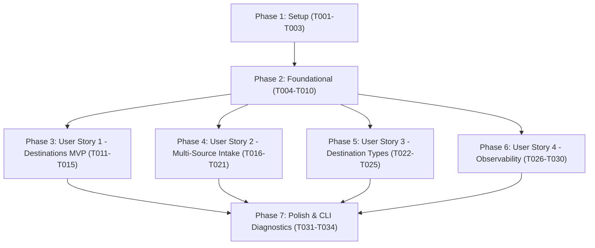

# Tasks: Per-Media-Type Source & Destination Routing

**Feature Branch**: `009-media-source-destination-routing`
**Spec**: [spec.md](spec.md) | **Plan**: [plan.md](plan.md) | **Data Model**: [data-model.md](data-model.md) | **Contracts**: [contracts/](contracts/)

---

## Phase 1: Setup (Shared Infrastructure)

**Purpose**: Initialize package structure and foundational routing test directories.

- [X] T001 Initialize routing package in media_cron/routing/__init__.py and test directory structure in tests/unit/routing/
- [X] T002 [P] Implement core routing domain models and enums in media_cron/routing/models.py
- [X] T003 [P] Implement RouteResolverProtocol and MediaRoutingEngineProtocol in media_cron/routing/base.py

---

## Phase 2: Foundational (Blocking Prerequisites)

**Purpose**: Core configuration schemas, fallback hierarchy, and mount safety validation that MUST be complete before ANY user story can run.

**⚠️ CRITICAL**: No user story work can begin until this phase is complete.

- [X] T004 [P] Unit tests for routing configuration models and validation rules in tests/unit/routing/test_routing_config.py
- [X] T005 [P] Contract tests for RouteResolverProtocol in tests/contract/test_route_resolver_contract.py
- [X] T006 Implement SourceEndpointConfig, DestinationEndpointConfig, and MediaRouteConfig data models in media_cron/config.py
- [X] T007 Update MusicConfig, AudiobookConfig, BooksConfig, and VideoConfig in media_cron/config.py to embed per-media routing blocks
- [X] T008 Implement environment variable parser and override bindings for per-media routing in media_cron/config.py
- [X] T009 Implement base RouteResolver with hierarchical fallback logic in media_cron/routing/resolver.py
- [X] T010 Implement destination root pre-existence mount safety validation in media_cron/routing/resolver.py

**Checkpoint**: Foundational configuration schemas and resolver verified with contract tests.

---

## Phase 3: User Story 1 - Dedicated Per-Media-Type Destination Routing (Priority: P1) 🎯 MVP

**Goal**: Route identified assets of each media type (`music`, `audiobooks`, `books`, `movies`, `tv`) to distinct configured destination roots with template formatting.

**Independent Test**: Configure separate destination paths for music and movies; run media-cron; verify music arrives in the music destination and movies in the movie destination, leaving fallback untouched.

### Tests for User Story 1 ⚠️
> **NOTE: Write these tests FIRST, ensure they FAIL before implementation**

- [X] T011 [P] [US1] Unit test for per-media destination resolution and template formatting in tests/unit/routing/test_destination_resolution.py
- [X] T012 [P] [US1] Integration test for multi-media destination organization in tests/integration/test_per_media_destination_routing.py

### Implementation for User Story 1

- [X] T013 [US1] Implement resolve_target_destination in media_cron/routing/engine.py
- [X] T014 [US1] Update Pipeline._resolve_destination_path in media_cron/pipeline.py to use RouteResolver
- [X] T015 [US1] Add mount safety enforcement to Pipeline.plan and Pipeline.execute in media_cron/pipeline.py

**Checkpoint**: User Story 1 is functional and testable independently (MVP ready).

---

## Phase 4: User Story 2 - Per-Media-Type Ingestion from Multiple Source Types (Priority: P2)

**Goal**: Ingest media from multiple sources per media type (directories and torrent client categories/tags), aggregate candidates, and enforce strict type filtering (quarantining mismatches into review).

**Independent Test**: Configure a directory source for books and a torrent category source for movies; verify book files are discovered from the directory and movies from torrents; verify non-music file in a music source is quarantined in review.

### Tests for User Story 2 ⚠️
> **NOTE: Write these tests FIRST, ensure they FAIL before implementation**

- [X] T016 [P] [US2] Contract tests for MediaRoutingEngineProtocol multi-source discovery in tests/contract/test_media_routing_engine_contract.py
- [X] T017 [P] [US2] Unit tests for multi-source aggregation and deduplication in tests/unit/routing/test_source_aggregation.py
- [X] T018 [P] [US2] Unit tests for strict source type filtering and review staging in tests/unit/routing/test_strict_source_filtering.py

### Implementation for User Story 2

- [X] T019 [US2] Extend DiscoveredItem in media_cron/models.py with source_media_type and source_endpoint_id
- [X] T020 [US2] Implement discover_route_items in media_cron/routing/engine.py with torrent client profile selection
- [X] T021 [US2] Implement validate_source_type_match in media_cron/routing/engine.py and integrate strict filtering with Pipeline.plan in media_cron/pipeline.py

**Checkpoint**: User Stories 1 AND 2 work independently.

---

## Phase 5: User Story 3 - Configurable Destination Operational Types (Priority: P3)

**Goal**: Support `spool` (drop folder) and `library` (structured templates) destination types independently per media type, with per-media transfer mode overrides (`hardlink`, `copy`, `move`).

**Independent Test**: Configure movies with spool destination and music with library destination; verify movies are deposited as release folders in spool directory while music is structured and renamed in library.

### Tests for User Story 3 ⚠️
> **NOTE: Write these tests FIRST, ensure they FAIL before implementation**

- [X] T022 [P] [US3] Unit tests for per-media destination operational types (spool vs library) in tests/unit/routing/test_destination_types.py
- [X] T023 [P] [US3] Unit tests for per-media transfer mode overrides in tests/unit/routing/test_per_media_transfer_mode.py

### Implementation for User Story 3

- [X] T024 [US3] Wire destination operational type dispatching in media_cron/routing/engine.py to route to spool engines when type is spool
- [X] T025 [US3] Integrate per-media transfer_mode resolution in media_cron/pipeline.py to apply route-specific transfer mode to OperationPlan

**Checkpoint**: User Stories 1, 2, and 3 work independently.

---

## Phase 6: User Story 4 - Backward Compatibility, Global Fallbacks & Observability (Priority: P4)

**Goal**: Ensure zero breaking changes for legacy global configurations, provide predictive `--dry-run` output, and emit per-media structured telemetry in `BatchSummary.routing_summary`.

**Independent Test**: Run with legacy config; verify identical behavior; run with `--dry-run`; verify resolved routes and planned destinations are reported; inspect telemetry JSON.

### Tests for User Story 4 ⚠️
> **NOTE: Write these tests FIRST, ensure they FAIL before implementation**

- [X] T026 [P] [US4] Integration test for legacy configuration backward compatibility in tests/integration/test_legacy_routing_compatibility.py
- [X] T027 [P] [US4] Unit test for per-media telemetry in tests/unit/routing/test_routing_telemetry.py

### Implementation for User Story 4

- [X] T028 [US4] Implement MediaRouteSummary and integrate routing_summary into BatchSummary in media_cron/models.py
- [X] T029 [US4] Update Pipeline batch execution to collect and report routing_summary statistics in media_cron/pipeline.py
- [X] T030 [US4] Update dry-run console formatting in media_cron/cli.py to display resolved media sources, destinations, and transfer modes

**Checkpoint**: All 4 user stories functional, observable, and backward-compatible.

---

## Phase 7: Polish & CLI Diagnostic Tools

**Purpose**: Diagnostic commands, cross-cutting polish, and end-to-end quickstart validation.

- [X] T031 [P] Implement media-cron routes list and media-cron routes validate commands in media_cron/cli.py
- [X] T032 [P] Unit tests for CLI routes commands in tests/unit/routing/test_routes_cli.py
- [X] T033 Execute all 5 end-to-end quickstart validation scenarios from specs/009-media-source-destination-routing/quickstart.md
- [X] T034 Run full test suite with pytest and lint verification with ruff across entire repository

---

## Dependencies & Execution Order

### Phase Dependencies



### User Story Dependencies

- **User Story 1 (P1)**: Depends on Phase 2 (Foundational). Delivers MVP destination routing.
- **User Story 2 (P2)**: Depends on Phase 2 (Foundational). Adds multi-source intake and strict isolation.
- **User Story 3 (P3)**: Depends on Phase 2 (Foundational) and US1 destination routing. Adds spool vs library operational modes and transfer mode overrides.
- **User Story 4 (P4)**: Depends on Phase 2 (Foundational). Adds backward compatibility verification and structured telemetry across all user stories.

---

## Parallel Execution Examples

### Parallel Opportunities within Setup & Foundational
```bash
# Setup parallel tasks:
Task: "T002 [P] Implement core routing domain models and enums in media_cron/routing/models.py"
Task: "T003 [P] Implement RouteResolverProtocol and MediaRoutingEngineProtocol in media_cron/routing/base.py"

# Foundational parallel tests:
Task: "T004 [P] Unit tests for routing configuration models in tests/unit/routing/test_routing_config.py"
Task: "T005 [P] Contract tests for RouteResolverProtocol in tests/contract/test_route_resolver_contract.py"
```

### Parallel Opportunities for User Story 1 (MVP)
```bash
# Write US1 tests in parallel:
Task: "T011 [P] [US1] Unit test for per-media destination resolution in tests/unit/routing/test_destination_resolution.py"
Task: "T012 [P] [US1] Integration test for multi-media destination organization in tests/integration/test_per_media_destination_routing.py"
```

### Parallel Opportunities for User Story 2
```bash
# Write US2 tests in parallel:
Task: "T016 [P] [US2] Contract tests for MediaRoutingEngineProtocol in tests/contract/test_media_routing_engine_contract.py"
Task: "T017 [P] [US2] Unit tests for multi-source aggregation in tests/unit/routing/test_source_aggregation.py"
Task: "T018 [P] [US2] Unit tests for strict source type filtering in tests/unit/routing/test_strict_source_filtering.py"
```

---

## Implementation Strategy

### MVP First (User Story 1 Only)
1. Complete Phase 1: Setup (`T001` - `T003`).
2. Complete Phase 2: Foundational (`T004` - `T010`).
3. Complete Phase 3: User Story 1 (`T011` - `T015`).
4. **STOP and VALIDATE**: Verify Scenario 1 in `quickstart.md` passes independently.

### Incremental Delivery
1. Phase 1 + Phase 2 → Infrastructure and configuration schemas ready.
2. Phase 3 (US1) → Media routes to independent destination roots (MVP delivers immediate storage partition value).
3. Phase 4 (US2) → Media ingests from multiple directories and torrent categories with strict quarantine.
4. Phase 5 (US3) → Drop folder spooling and per-media transfer mode overrides enabled.
5. Phase 6 (US4) → Telemetry and legacy compatibility verified.
6. Phase 7 → Diagnostic CLI commands (`routes list`, `routes validate`) and test suite verification.
